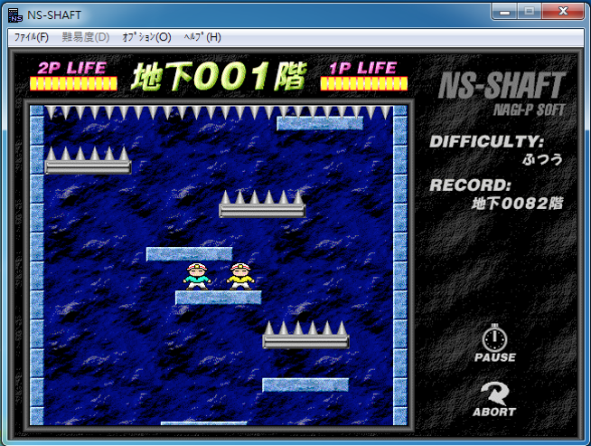

## 小朋友下樓梯
</img>

## Report
---
含括功能
1. A complete game process: start menu => game view => game over => quit or play again  | YES |

2. Your game should follow the basic rules of  "小朋友下樓梯" | YES |
3. All things in your game should have correct physical properties and behaviors  | YES |
4. Set up some interesting traps or special mechanisms. .(at least 2 different kinds of platform)| YES |
5. Add some additional sound effects and UI to enrich your game | YES |
6. Store player's name and score in firebase real-time database, and add a leaderboard to your game | YES |
7. Appearance (登入介面美化，背景畫面，排行榜美化等等)
8. other creative features :
    單人模式(可列入排行)、雙人模式、登入登出功能
